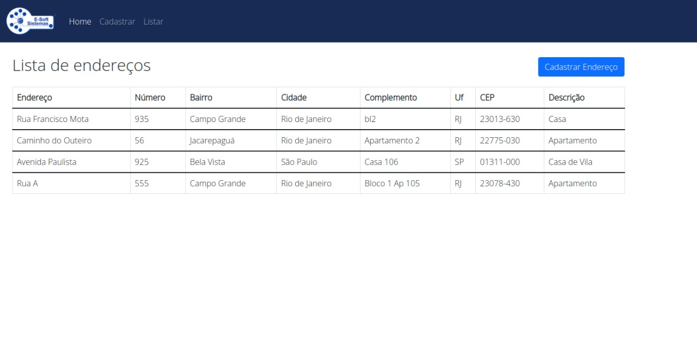
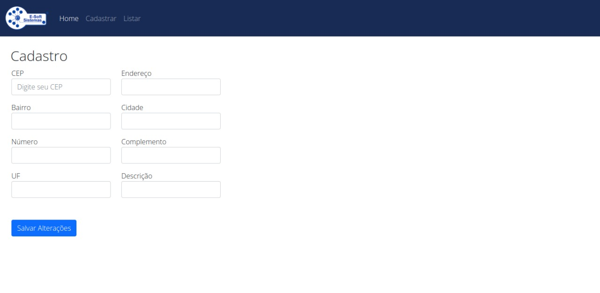

Sistema de cadastro e listagem de endereços, utilizando Python e Django | Docker | MySql 

## Primeiros passos

Instalando o projeto

- Instale o docker 
- Instalar Virtualenv


```bash
source venv/bin/activate
pip install -r requirements.txt
docker-compose up 
python manage.py runserver  
```
    
## Funcionalidades

- Listagem de endereços cadastrados 
- Cadastro de endereços 
- Autocomplete CEP, usando uma API própria e a API Viacep


## Screenshots




